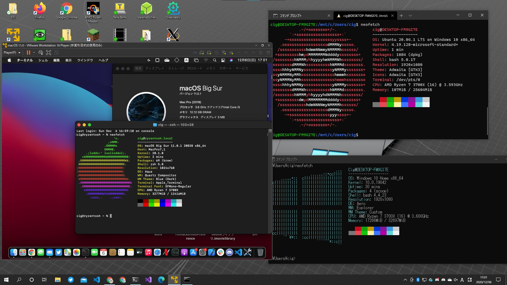

# OpenCore on VMWare Player
Booting macOS via OpenCore on VMware.



**This can Boot macOS on Ryzen on VMWare Player 16**!!

# Features
- Can use OpenCore Option on VMware Player!!
  - This allows you to config SMBIOS and research!
- Can Boot macOS **on Ryznen on VMWare Player 16**!!
  - This allows you to use a macOS VM in an environment where you have Hyper-V or WSL2 installed on Ryzen!

# Note

**If you do not use the OpenCore features, nothing makes sense.**

If you are an Intel user, you can build a macOS VM environment with only the latest VMware and unlocker.

Config.plist's Kernel Patch is only for AMD CPU.

# How to use 

## Prerequisites

VMWare Player patched with unlocker.

1. After configuring VMware as usual, set OpenCore_Ryzen.vmdk to the virtual disk.

2. Open the vmx file with a text editor or similar and add the following lines.
```
BIOS.BootDelay = "1500"
```
(This option increases the BIOS acceptance time.)

3. Boot Virtual Machine. As soon as you see the VMware logo, click on the window to enter the virtual machine and hit the F11 key repeatedly.

4. After show up Boot Manager, select SATA Hard Drive **(2.0)**.

5. When OpenCore comes up, launch the desired one. (e.g. installer or macOS).

Done!

# Technical Explanation

This OpenCore includes only the bare minimum of settings.

By daring to do this, OpenCore will not load any extra settings!
(VMware Player has macOS's Driver.) 

## How to edit vmdk

The service that comes with VMware cannot be mounted vmdk, so install the latest VDDK and use that service.

1. [Download VDDK(Virtual Disk Development Kit)](https://my.vmware.com/jp/group/vmware/downloads/get-download?downloadGroup=VDDK700) And Extract.

Note:You need to register for this, **but it is free**.

If you're using Windows,download the zip one.

2. Run bin/vstor2install.bat in the unzipped folder as Administor.

Done Install.

Right-click on vmdk and select "Map the virtual disk" to mount it.